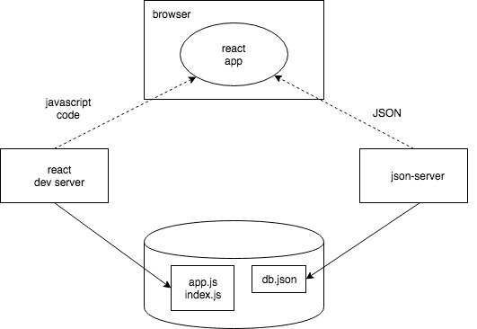

# React form simple practice

Shijing Liu 2020-10-09

useState useEffect (for connect server)

browser:localhost:3000

server: localhost:3001/notes

update each item important or not ,also update into database

post and get data from DB

